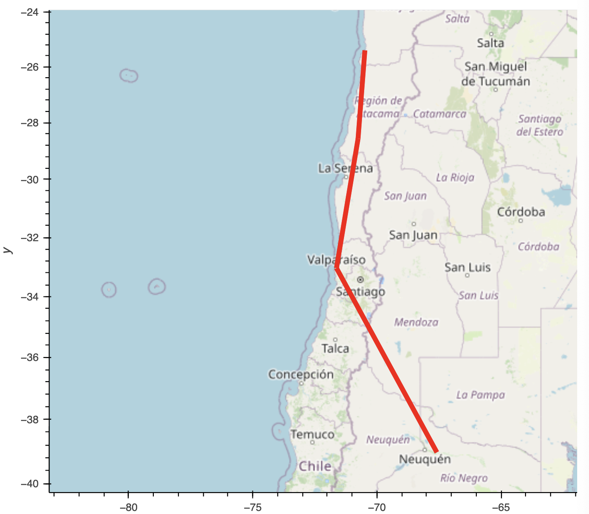

# WeatherPy-Analysis

In this analysis, we created a dataframe of randomly generated coordinates, and found closest hotels to those coordinates, we then created a world map of those coordinates, and found 4 cities close to each other to create a travel plan with.

